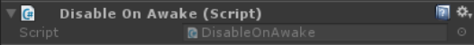
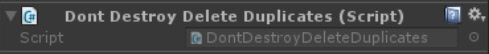
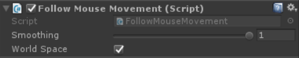
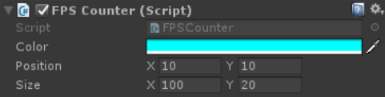
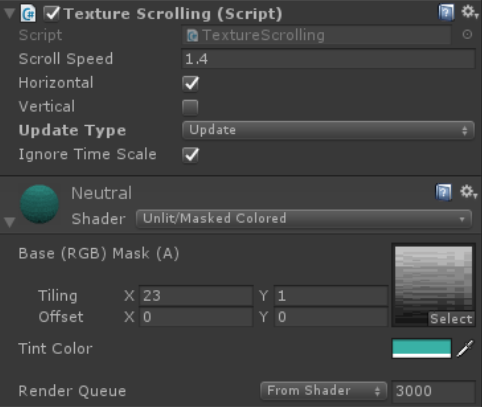

## Comment.cs


Add a String to any GameObject to make a note or comment. Optionally set "Display On Screen" to draw that Text at the position of the Owner-GameObject (in relation to the main camera).
In addition can throw a Debug.Log() of that comment and / or remove the component at runtime.

## DisableOnAwake.cs

```
- Requires you to add the tag 'RemoveAtRuntime' to Unity and the corresponding GameObjects

Partner-Script to **DontDestroyDeleteDuplicates** wich disables all GameObjects tagged with `RemoveAtRuntime` in the current Scene on Awake.

## DontDestroyDeleteDuplicates.cs


```diff
- Requires you to add the tag 'Persistent' to Unity and the corresponding GameObjects
```

Add this script to any GameObject that is supposed to stay persistent through all scenes and tag that GO as 'Persistent'.
The advantage of this script is that it removes any duplicate that Unity creates when going back to a previously visited scene.
With the 'RemoveAtRuntime' Tag you can have tagged GameObjects be destroyed when a new scene has been loaded. Useful if you have a similar 
GOs in several scenes for testing purposes but only want one copy to be persistent at the beginning, wich then destroys all those testing-copies.

## FollowMouseMovement

```
- Requires you to add the tag 'UICamera' to Unity and set the camera that renders the objects with this script attached to it; 
- alternatively replace all "UICamCamera.ScreenToWorldPoint" parts with "Camera.main.ScreenToWorldPoint" to automatically get the Camera with the tag 'Main Camera' on it
```
When this script is enabled it actively follows the current mouse-/touch-position in 2D space (that's why it disables itself On Awake(), so that you can enable it manually later when needed).

## FPSCounter.cs


A modification of the Standard Assets' FPSCounter that is converted to OnGUI instead of uGUI (draws directly on screen instead of requiring a Canvas and uGUI-Components).

## TextureScrolling.cs


Wraps the texture of the material around the mesh (changes the Texture-Offset) at the specified speed and direction. Negative speed goes into the opposite direction.
The possible directions are: Horizontal, vertical, both (diagonal) or none (doesn't move).

I used it for a seamlessly scrolling background in a Character-Introduction-Screen. 
That background had a Quad-MeshFilter, a Mesh-Renderer with any Material that has a Texture-Field with Offset (like `Unlit/Masked Colored`) and this script on it to.
